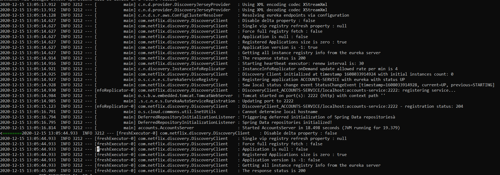
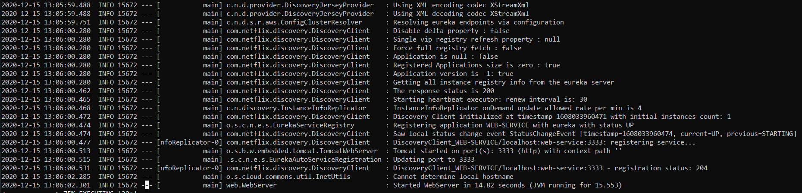
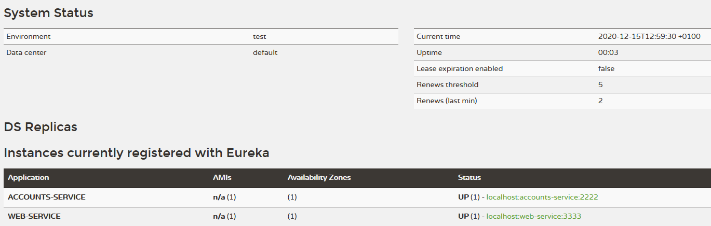
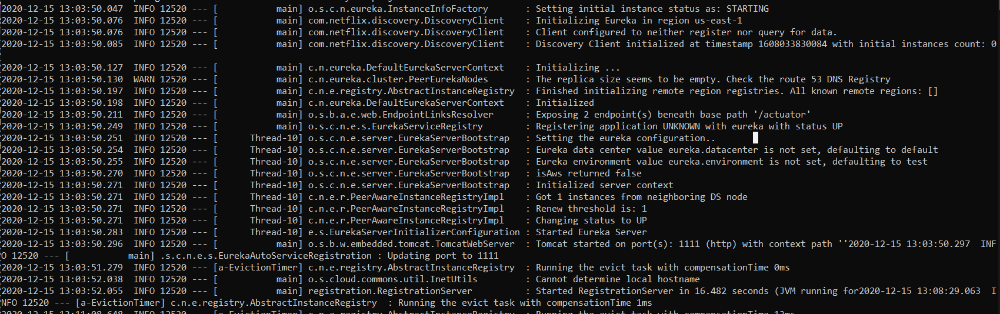
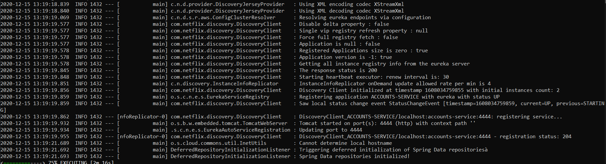
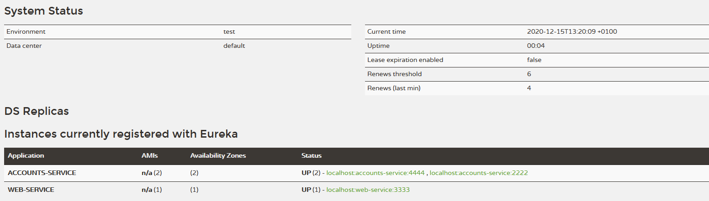

# Report
* **The two microservices `accounts (2222)` and `web` are running and registered (two terminals, logs screenshots).**
    * Accounts(2222) log:
        
    * Web log:
        

* **The service registration service has these two microservices registered (a third terminal, dashboard screenshots)**
    * Registration log:
        
    * Dashboard:
        

* **A second `accounts` microservice instance is started and will use the port 4444. This second `accounts (4444)` is also registered (a fourth terminal, log screenshots).**
    * Accounts(4444) log:
        
    * New dashboard:
        

* **What happens when you kill the microservice `accounts (2222)` and do requests to `web`?  Can the web service provide information about the accounts again? Why?**
    * Dashboard receives the update and remove it from the list. Yes, there is still a process alive to provide that service, but now in other port (4444)
